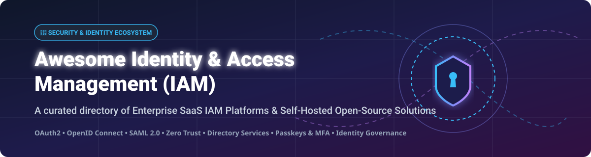

# Awesome Identity & Access Management (IAM) 🔐

  
  
  
  
  
  

---

## 🚀 Top Identity & Access Management (IAM) Platforms Ecosystem

**Curated List of Enterprise SaaS Products & Self-Hosted Open-Source GitHub Projects**

*Focused on Workforce & Customer Identity (CIAM), Single Sign-On (SSO), Multi-Factor Authentication (MFA), Directory Services, Privileged Access Management (PAM), Zero Trust, and Identity Governance & Administration (IGA).*

**Last updated: October 2026**

---

### 💡 Overview & SEO Summary

Identity and Access Management (IAM) is the fundamental security discipline and framework of business processes, policies, and technologies that facilitates the management of electronic or digital identities. Whether you are looking for enterprise cloud identity platforms or self-hosted open-source identity providers (IdPs) supporting OAuth 2.0, OpenID Connect (OIDC), and SAML 2.0, this guide covers the complete ecosystem.

---

## 📑 Table of Contents

- [🌐 SaaS / Hosted IAM Platforms](#-saashosted-iam-platforms)
- [🔓 Open-Source GitHub Projects](#-open-source-github-projects)
- [🛠️ Key Frameworks & Architecture Guidelines](#%EF%B8%8F-key-frameworks--architecture-guidelines)
- [🤝 How to Contribute](#-how-to-contribute)
- [💖 Support & Sponsorship](#-support--sponsorship)
- [⚠️ Disclaimer](#%EF%B8%8F-disclaimer)
- [⭐ Star History](#-star-history)

---

## 🌐 SaaS / Hosted IAM Platforms

> 📈 **Market Size & Structure**: The global Identity and Access Management (IAM) market is estimated at **$18.2 Billion in 2026** (projected to reach **$34+ Billion by 2030** at a CAGR of 13.5%). The market is **moderately fragmented**, featuring massive cloud platform providers (Microsoft Entra ID, IBM), dominant independent pure-plays (Okta, CyberArk, Ping Identity), and specialized identity governance and developer-first security suites.

The table below lists top enterprise SaaS IAM providers, ordered by market size (Revenue / Corporate Valuation descending):

| SaaS Platform 🏢 | Valuation / Revenue 💰 | Starting Pricing (Paid Tier) 💳 | Free Tier / Free Trial Limits 🎁 | Description & Core Features ⚡ |
| :--- | :--- | :--- | :--- | :--- |
| **[Microsoft Entra ID](https://www.microsoft.com/en-us/security/business/identity-access/microsoft-entra-id)** | **~$245B+ Market Cap** *(Parent Microsoft)* | **$6.00 / user / month** (Entra ID P1) | **Free Plan Included** with M365 / Azure (Basic SSO, MFA & User Sync up to 500k objects) | Microsoft’s cloud identity platform providing SSO, Conditional Access, MFA, identity protection, and deep Microsoft 365 / Azure integration. |
| **[IBM Security Verify](https://www.ibm.com/products/verify-identity)** | **~$190B+ Market Cap** *(Parent IBM)* | **$1.75 / user / month** | **90-Day Free Trial** (Full enterprise feature suite for up to 100 test users) | IBM’s identity & access management suite covering workforce, privileged access, and customer identity with governance. |
| **[Okta](https://www.okta.com/)** | **~$16.5B Market Cap** | **$2.00 / user / month** (SSO Starter) | **30-Day Free Trial** (Workforce Identity Cloud) or **Okta Developer Free Tier** (Up to 7,800 MAU) | Leading independent identity platform for workforce & customer identity with extensive app integrations, SSO, and MFA. |
| **[CyberArk](https://www.cyberark.com/)** | **~$13.2B Market Cap** | **$3.00 / user / month** (Identity SSO) | **30-Day Free Trial** (Includes Identity & Privileged Access Security testing) | Security-first identity platform specializing in Privileged Access Management (PAM), endpoint privilege, and identity security. |
| **[SailPoint](https://www.sailpoint.com/)** | **~$7.5B Valuation** *(Thoma Bravo)* | **$15.00 / user / month** (Identity Security Cloud) | **30-Day Guided Enterprise Sandbox / Demo** (No permanent free tier) | Leading Identity Governance & Administration (IGA) platform for access certification, user lifecycle, and compliance. |
| **[Ping Identity](https://www.pingidentity.com/)** *(Inc. ForgeRock)* | **~$7.2B Valuation** *(Thoma Bravo)* | **$3.00 / user / month** (PingOne Essential) | **30-Day Free Trial** (Unlimited admin testing & SSO integration sandbox) | Enterprise IAM & CIAM platform (incorporating ForgeRock) strong in hybrid federation, complex auth, and customer identity. |
| **[Auth0](https://auth0.com/)** *(By Okta)* | **~$6.5B Acquisition Value** | **$35.00 / month** (B2C Essentials - 500 MAU) | **Free Forever Plan** (Up to 25,000 Monthly Active Users & 5 Enterprise Connections) | Developer-centric identity platform for authentication, authorization, passkeys, and customer identity use cases. |
| **[JumpCloud](https://jumpcloud.com/)** | **~$2.6B Valuation** | **$3.00 / user / month** (Core Directory) | **Free Forever Plan** (Full platform features for up to 10 Users & 10 Devices) | Cloud directory & IAM platform popular with SMBs and mixed-OS environments, combining directory, SSO, and MDM. |
| **[OneLogin](https://www.onelogin.com/)** | **~$500M Acquisition Value** *(One Identity)* | **$2.00 / user / month** (Advanced SSO) | **30-Day Free Trial** (Full access to Advanced SSO & Multi-Factor Authentication) | Cloud IAM solution focused on SSO, MFA, and directory integration for mid-market and enterprise customers. |

---

## 🔓 Open-Source GitHub Projects

The following self-hosted open-source identity providers, OAuth2/OIDC servers, and IAM frameworks are sorted descending by their **GitHub Star Count** 🌟:

| Open-Source Project 🛠️ | GitHub Stars ⭐ | Primary Stack / Language 💻 | Protocols & Key Features 🔑 |
| :--- | :---: | :---: | :--- |
| **[Keycloak](https://github.com/keycloak/keycloak)** |  | Java | Leading enterprise IdP — OIDC, SAML 2.0, User Federation (LDAP/AD), SSO, MFA, & Fine-Grained Authorization. |
| **[Authelia](https://github.com/authelia/authelia)** |  | Go / TypeScript | Lightweight 2FA & SSO authentication server tailored for reverse proxies (Traefik, Nginx, Caddy). |
| **[Authentik](https://github.com/goauthentik/authentik)** |  | Python / Go | Modern, flexible open-source identity provider with built-in proxy support, clean UI, & flow builder. |
| **[Casbin](https://github.com/casbin/casbin)** |  | Go / Multi-language | Powerful & efficient open-source access control library supporting ACL, RBAC, ABAC, & RESTful enforcement. |
| **[SuperTokens](https://github.com/supertokens/supertokens-core)** |  | Java / TypeScript | Open-source alternative to Auth0/Firebase — Session management, Social Login, Passwordless, & User Management. |
| **[Zitadel](https://github.com/zitadel/zitadel)** |  | Go | Cloud-native multi-tenant IdP with audit trails, Passkeys/FIDO2, OIDC, SAML, & modern gRPC/REST APIs. |
| **[Logto](https://github.com/logto-io/logto)** |  | TypeScript | Developer-friendly Auth0 alternative with out-of-the-box Sign-in UI, OIDC, RBAC, & multi-tenancy. |
| **[Casdoor](https://github.com/casdoor/casdoor)** |  | Go / React | UI-first Web UI IAM platform supporting OAuth 2.0, OIDC, SAML, WebAuthn, & single sign-on integration. |
| **[Ory Kratos](https://github.com/ory/kratos)** |  | Go | API-first identity & user management system built for cloud-native microservices architectures (Ory Ecosystem). |
| **[Kanidm](https://github.com/kanidm/kanidm)** |  | Rust | Fast, modern, security-focused identity management engine & directory server built in Rust for Linux environments. |
| **[FreeIPA](https://github.com/freeipa/freeipa)** |  | Python / C | Red Hat sponsored enterprise identity system integrating 389 Directory Server (LDAP), MIT Kerberos, & DNS. |
| **[WSO2 Identity Server](https://github.com/wso2/product-is)** |  | Java | API-driven enterprise IAM server with complex identity federation, adaptive authentication, & CIAM tools. |
| **[Janssen Project](https://github.com/JanssenProject/jans)** |  | Python / Java | Linux Foundation project (successor to Gluu) providing high-concurrency OIDC, FIDO2, & SCIM services. |
| **[Apache Syncope](https://github.com/apache/syncope)** |  | Java | Apache Foundation digital identity management system for managing user lifecycle, provisioning, & governance. |

---

## 🛠️ Key Frameworks & Architecture Guidelines

- **Workforce vs Customer Identity (CIAM)**:
  - **Workforce IAM** focuses on employee lifecycle, SAML/OIDC SSO, SCIM provisioning, and device/endpoint security (e.g., Entra ID, Okta, JumpCloud, Keycloak).
  - **Customer IAM (CIAM)** demands high scale, low latency, friction-free login (Social Login, Passkeys, Magic Links), and developer APIs (e.g., Auth0, Logto, SuperTokens, Zitadel, Ory).

- **Self-Hosted Open-Source vs SaaS Decision Criteria**:
  - Choose **Open-Source** (Keycloak, Authentik, Zitadel) if you require total data sovereignty, custom protocol plugins, air-gapped deployment, or want to eliminate per-seat licensing.
  - Choose **SaaS** (Microsoft Entra, Okta, Ping Identity) for compliance certifications (SOC2, HIPAA, FedRAMP out of the box), zero-upkeep high availability, and out-of-the-box pre-integrated SaaS connectors.

---

## 🤝 How to Contribute

Contributions are welcome! Please follow these simple steps:

1. Fork this repository.
2. Add or update entries in `README.md` following the tabular formatting.
3. Ensure exact pricing/star details are included.
4. Submit a Pull Request (PR) with a clear description of your changes.

---

## 💖 Support & Sponsorship

Thank you for exploring and using this repository! If you find this curated list of Identity & Access Management platforms helpful:

- 🌟 **Star** this repository to help others discover it!
- 🍴 **Fork** it to keep your own reference copy.
- 📢 **Share** it with your fellow security engineers, DevOps specialists, and developers.

If you'd like to support ongoing open-source curation and development, consider buying me a coffee or becoming a sponsor:

---

## ⚠️ Disclaimer

- This is a **community-curated list** — created for educational and architectural reference purposes.
- Identity management systems form the critical security backbone of modern organizations. Always perform thorough security assessments, penetration testing, and audits before deploying any identity software to production.

---

## ⭐ Star History

---

  <b>Made for Security Engineers, Identity Architects, and Open-Source IAM Advocates 🛡️</b>

